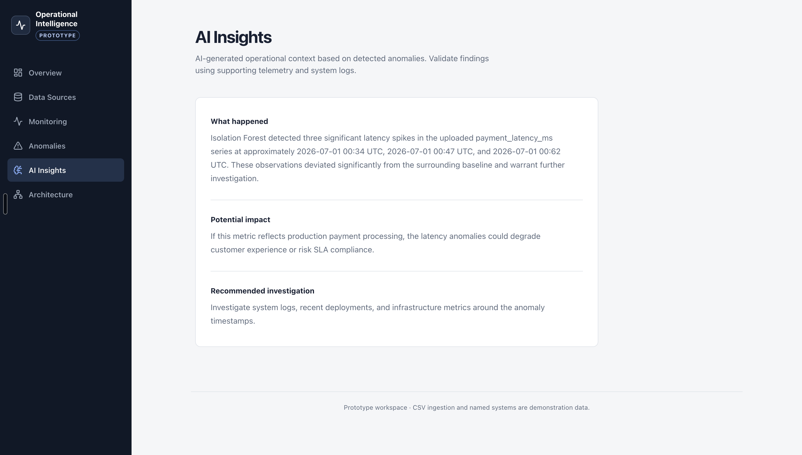

# Operational Intelligence Platform

An AI-powered web application that helps engineering teams investigate unusual operational activity faster.

Users upload telemetry data as a CSV, detect anomalies, review visual results, and generate AI-powered explanations with likely causes and recommended next steps.

## Live Product

https://operational-intelligence-five.vercel.app/

## How to Use

1. Upload a CSV containing ordered time-series data.
2. Click **Analyze**.
3. Review the detected anomalies and visualization.
4. Generate an AI explanation for likely causes, impact, and next steps.

## Screenshots

### Upload Telemetry


### Anomaly Detection Results


### AI Investigation



## How It Works

```text
Upload CSV
   ↓
Feature Engineering
   ↓
Isolation Forest
   ↓
Anomaly Results
   ↓
RAG + OpenAI
   ↓
Operational Explanation
